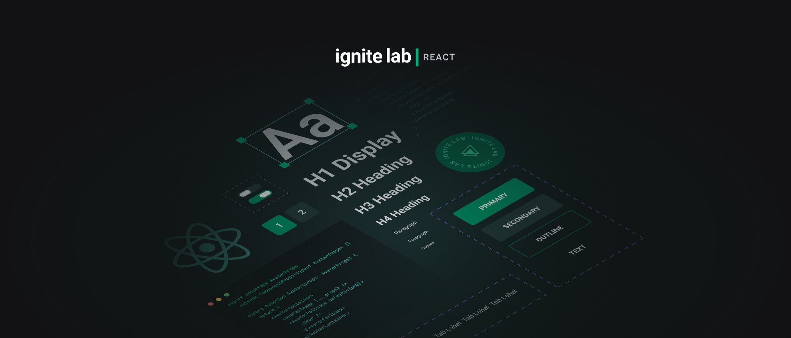
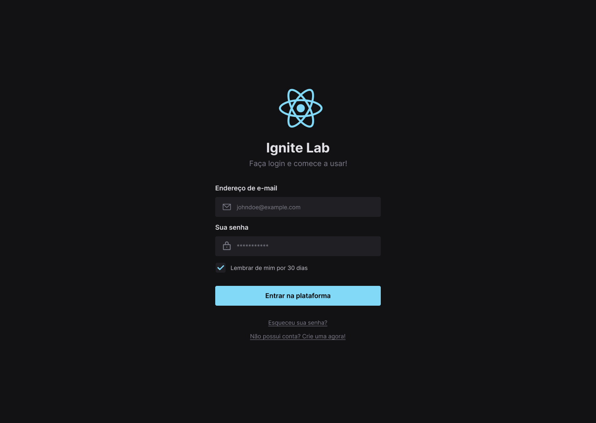

<div align="center">
  
  <h3>Ignite Lab - Do Figma ao React (Design System)</h3>
</div>
<br/>
<div align="center">
   <a href="https://github.com/mathrb22">
      
   </a>
   
   
   <a href="https://github.com/mathrb22/IgniteLab-Design-System/commits/main">
      
   </a>
   <a href="https://github.com/mathrb22/IgniteLab-Design-System/issues">
      
   </a>
   <a href="https://github.com/mathrb22/IgniteLab-Design-System/pulls">
      
   </a>
   </br>
   </br>
   <a href="#-tecnologias-utilizadas">
      
      
      
      
   </a>
</div>

</br>
<div align="center">

[**Sobre**](#-sobre) &nbsp;&nbsp;**|**&nbsp;&nbsp;
[**Tecnologias e ferramentas utilizadas**](#-tecnologias-e-ferramentas-utilizadas) &nbsp;&nbsp;**|**&nbsp;&nbsp;
[**Design**](#-layout) &nbsp;&nbsp;**|**&nbsp;&nbsp;
[**Instalação e execução**](#-instalação-e-execução) &nbsp;&nbsp;**|**&nbsp;&nbsp;
[**Como contribuir**](#-como-contribuir) &nbsp;&nbsp;**|**&nbsp;&nbsp;
[**Contato**](#-contato) &nbsp;&nbsp;**|**&nbsp;&nbsp;

</div>

## 📃 Sobre



Este é o projeto desenvolvido durante o Ignite Lab, um evento online produzido pela [**Rocketseat**](https://github.com/Rocketseat), durante os dias 10 a 14 de outubro de 2022.

O projeto consiste na criação e implementação de um Design System. Para isso, inicialmente foram desenvolvidos os componentes e suas variações no Figma, e em seguida implementados no código, utilizando o React e a ferramenta Storybook para a documentação dos componentes.

## 🚀 Tecnologias e ferramentas utilizadas

Este projeto foi desenvolvido com as seguintes tecnologias e ferramentas:

- [**Figma**](https://www.figma.com/): ferramenta de prototipação e design de interfaces.

- [**React**](https://reactjs.org/): uma biblioteca JavaScript de código aberto com foco em criar interfaces de usuário (frontend) em páginas web. É mantido pelo Facebook, Instagram, outras empresas e uma comunidade de desenvolvedores individuais. É utilizado nos sites da Netflix, Imgur, Feedly, Airbnb, SeatGeek, HelloSign, Walmart e outros;

- [**TypeScript**](https://www.typescriptlang.org/): um super conjunto da linguagem JavaScript que fornece classes, interfaces e tipagem estática opcional. Utilizado em conjunto com React no frontend web;

- [**Vite.JS**](https://vitejs.dev/): ferramenta de construção para front-end moderna que oferece uma experiência de desenvolvimento mais rápida e mais eficiente;

- [**Storybook**](https://storybook.js.org/): uma ferramenta voltada para o desenvolvimento de componentes de interface de usuário isolados, usada por empresas como GitHub, Dropbox, airbnb, Mozilla, entre outras;

- [**RadixUI**](https://www.radix-ui.com/): um conjunto de componentes React acessíveis, flexíveis e com baixo acoplamento, que podem ser usados ​​para construir interfaces de usuário complexas.

- [**Visual Studio Code**](https://code.visualstudio.com/): um editor de código-fonte desenvolvido pela Microsoft para Windows, Linux e macOS, recomendado para o desenvolvimento de aplicações web;

## 📟 Design



O design do projeto foi desenvolvido no Figma, e pode ser acessado através do link: [**Ignite Lab - Design System**](https://www.figma.com/file/GtextqwoVpkKJrFD8Nt9IO/Ignite-Lab---Design-System?node-id=14%3A72).

## 🔧 Instalação e execução

Para baixar o código-fonte do projeto em sua máquina, primeiramente terá que ter instalado o [**Git**](https://git-scm.com/).

Com o Git instalado, em seu terminal execute o seguinte comando:

```bash
git clone https://github.com/mathrb22/IgniteLab-Design-System.git
```

Para instalar as dependências e executar o projeto terá que ter instalado em sua máquina o [**Node.js**](https://nodejs.org/en/), que vem acompanhado do NPM. Com ele instalado:

- Instale as dependências do projeto:

  ```bash
  npm install
  ```

- Execute o projeto:

  ```bash
  npm run dev

  ```

- Execute a interface do Storybook:

  ```bash
  npm run storybook
  ```

## 💡 Como contribuir

- Faça um **_fork_** desse repositório;
- Crie um **branch** para a sua feature: `git checkout -b minha-feature`;
- Faça um **commit** com suas alterações: `git commit -m 'feat: Minha nova feature'`;
- Faça um **push** para o seu branch: `git push origin minha-feature`;
- Faça um **pull request** com sua feature;

Pull requests são sempre bem-vindos. Em caso de dúvidas ou sugestões, crie uma _**issue**_ ou entre em contato comigo.

## 📲 Contato

Entre em contato comigo por e-mail ou pelo meu LinkedIn:

<a href="mailto:math.ribeiro.dev@gmail.com"></a>
<a href="https://www.linkedin.com/in/matheus-ribeiro-dev/"></a>

---

<h5 align="center">
  &copy;2022 - <a href="https://github.com/mathrb22/">Matheus Ribeiro</a>
</h5>
```
